#   Yapay Sinir Ağları  

.fx: first

Harun Öztürk `<harun.ozturk@bil.omu.edu.tr>`

Özcan Çamoğlu `<ozcan.camoglu@bil.omu.edu.tr>`

##  Konular

-   Danışmansız Öğrenme (Unsupervised Learning)

-   Yarışmacı Öğrenme (Competitive Learning)

-   Özörgütlemeli Harita Ağı (Self Organizing Map)

Özörgütlemeli harita ağı, yarışmacı öğrenme algoritmasını kullanır

Danışmansız öğrenme yöntemlerinden biridir

#   Danışmansız Öğrenme

##  Nedir?

-   Sisteme nasıl davranması gerektiğini söyleyen insan/makine yok

-   Sisteme çıkış bilgisi verilmez

-   Genelde çıkış hakkında bilgimizin olmadığı problemlerle boğuşur

-   Girişlere göre kendi kendini eğitir

-   Ağ, işlemleri yaparak **zamanla** öğrenir

##  Danışmansız Öğrenme

![unsupervised] (media/unsupervised.jpg)

-   Giriş verileri karmaşık

-   Bir algoritmadan geçir

-   Kümelenmiş veriler

#   Yarışmacı Öğrenme

##  Nedir?

-   Giriş verilerine göre proseslerin yarıştığı bir yaklaşımdır

-   Giriş verilerini kümelemek için kullanılır

-   Danışmansız öğrenme veya destekleyici öğrenme ile kullanılabilir

-   Giriş elemanları ağdaki bütün proseslere bağlıdır

-   Yarış sonunda bir proses kazanır

-   Kazanan prosesin ağırlıkları güncellenir

-   Yaklaşıma göre kazanan prosesin komşularının ağırlıkları da güncellenebilir

##  Yarışmacı Öğrenme

-   BMU: Best Match Unit

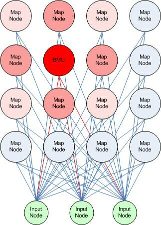

##  Yarışmacı Öğrenme

-   Bir prosesin bir giriş verisine yakın olması

-   Kazanan proses giriş verisine yaklaştırılır

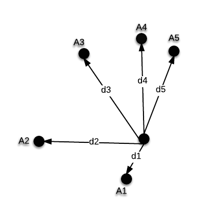

##  Yarışmacı Öğrenme

-   Çıkışa göre veya öklid uzaklığına göre

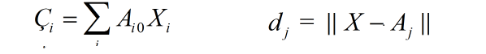

-   Büyük olan veya yakın olan

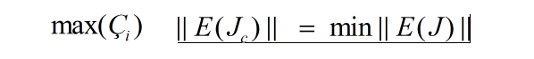

-   Yarışı kazanır

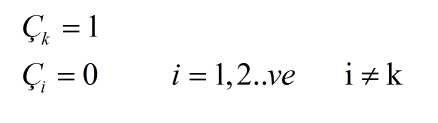

##  Farklı Yaklaşımlar

-   Sadece kazanan proses değil komşuları da güncellensin

Özörgütlemeli harita ağı

-   Yarışı kazanan ve ikinci olan proses güncellensin

-   Kazananı yaklaştır, ikinci olanı uzaklaştır

-   Sınır değerlerini iyileştirmek için kullanılır

LVQ2: Linear Vector Quantization

-   Destekleyici öğrenmede yanlış sınıfa ait proses kazanırsa

-   O prosesi uzaklaştırırken doğru sınıfın yerel kazananını yakınlaştır

LVQ-X

-   Bir proses sürekli kazanıyorsa cezalandır

#   Özörgütlemeli Harita Ağı

##  Nedir?

-   Yarışmacı öğrenimle eğitilen ileri beslemeli ağ

-   Giriş katmanı ve yarışmacı katmanından oluşur

-   Yarışmacı katmanına Kohonen katmanı denir

-   Kohonen katmanında ki her bir prosese bütün girişler bağlanır

##  Özörgütlemeli Harita Ağı

-   Kazanan proses elemanı belirlenir

-   Kazanan prosesin ağırlıkları değiştirilir

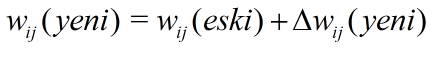

##  Özörgütlemeli Harita Ağı

-   Değişim miktarı

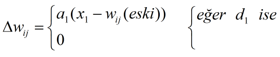

-   Öğrenme katsayısı güncellenir

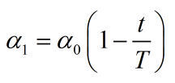

-   Topolojik çap azaltılır

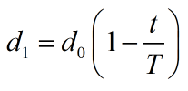

##  Örnek

-   Öğrenme katsayısı α0 = 0.6

-   Ağırlıklar

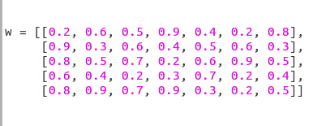

-   Giriş değerleri

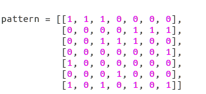

##  Ağ Yapısı

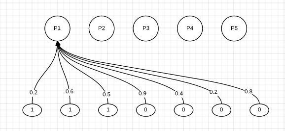

-   Sadece ilk değer için gerçekleştireceğiz

##  Öklid Uzaklıkları

-   P1 prosesinin [1, 1, 1, 0, 0, 0, 0] noktasına öklid uzaklığı

sqrt(

     (0.2-1)^^2 + (0.6-1)^^2 + (0.5-1)^^2 +

     (0.9-0)^^2 + (0.4-0)^^2 + (0.2-0)^^2 +

     (0.8-0)^^2 ) = 1.6431

P2 = 1.2328

P3 = 1.3564

P4 = 1.3928

**`P5 = 1.1532`**

##  Kazanan Proses

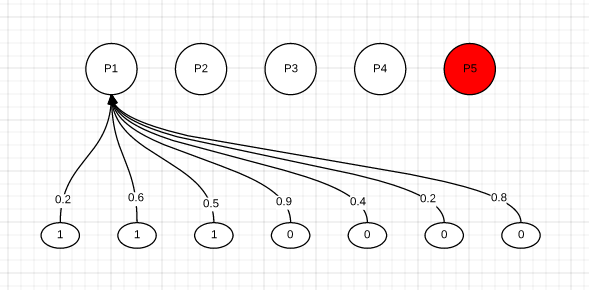

-   Kazanan proses belirlendi

-   Ağırlıklar değiştirilecek

##  Ağırlıkların Değişimi

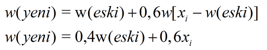

-   Eski ağırlıklar **[0.8, 0.9, 0.7, 0.9, 0.3, 0.2, 0.5]**

-   Güncellenmiş ağırlıklar **`[0.92, 0.96, 0.88, 0.36, 0.12, 0.08, 0.2]`**

##  Diğer Girdi Değerleri

-   Diğer girdi değerleri için aynı adımları tekrarla

##  Öğrenme Katsayısını Güncelle

-   Bir epoch tamamlandıktan sonra α0 öğrenme katsayısını güncelle

t: İterasyon adımı

T: Toplam işlem sayısı

-   Zamanla sıfıra yakınsar

##  Özörgütlemeli Harita Ağı

.code: code/som.py

